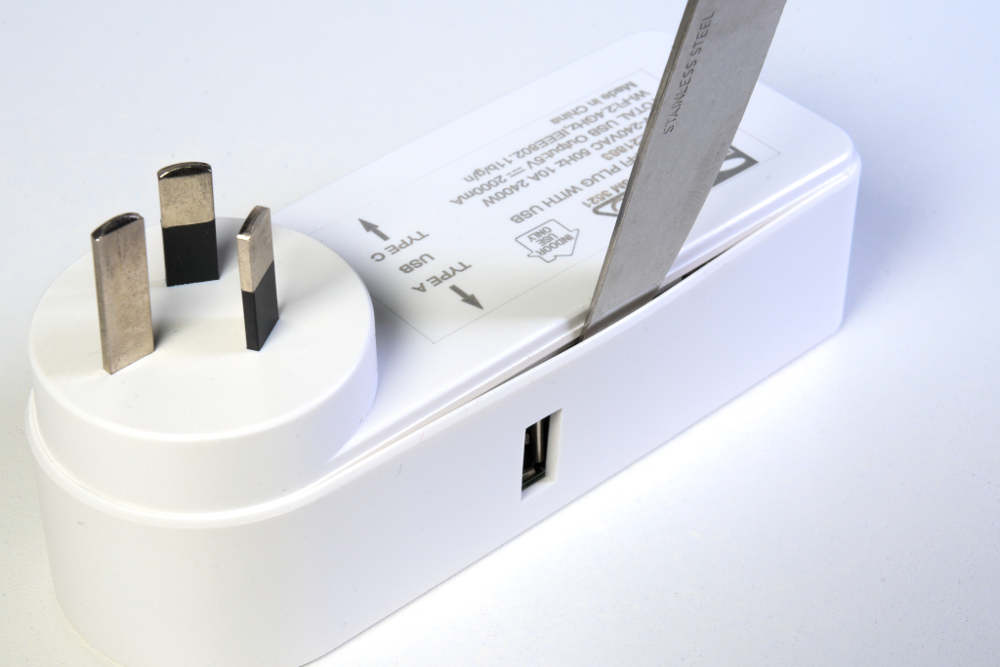
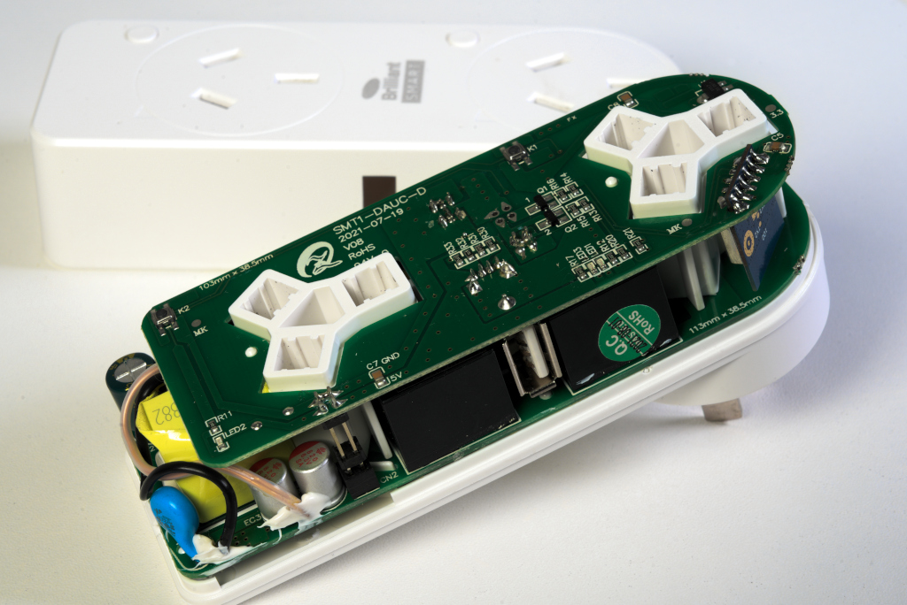
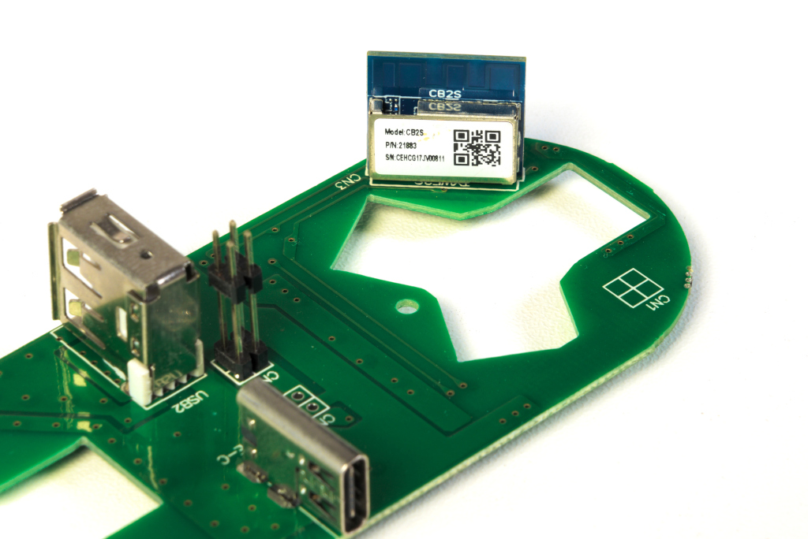
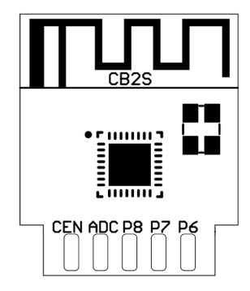
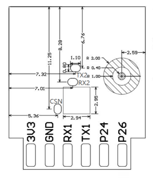
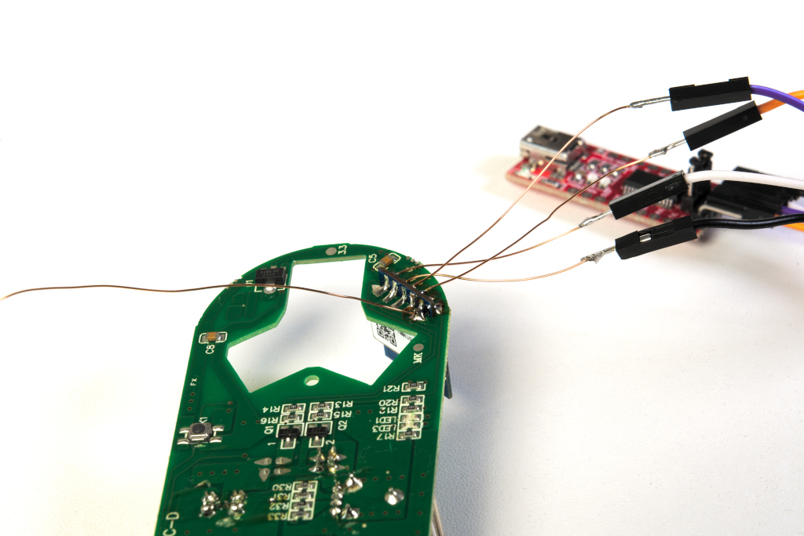
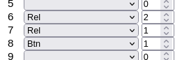
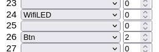
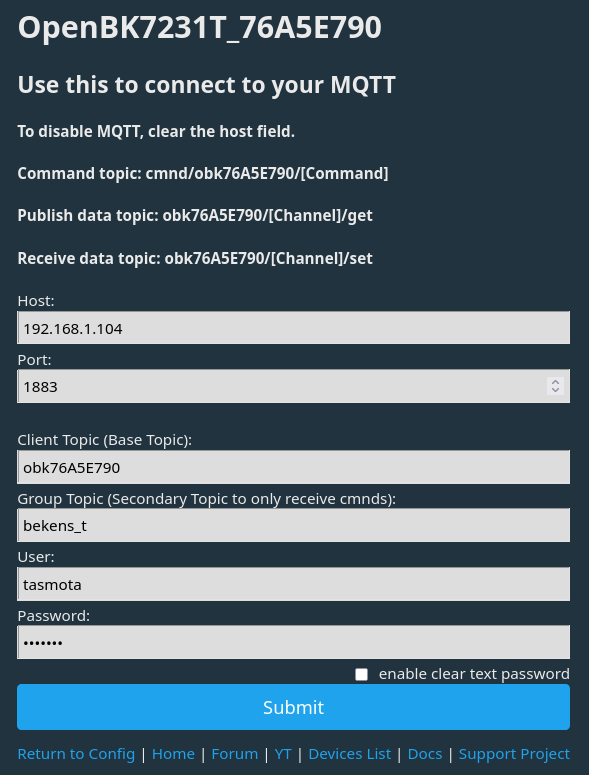
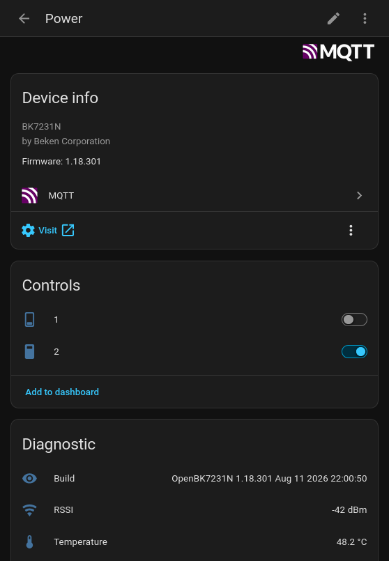

# Brilliant 21883/05 Double Wall Plug Flashing Guide

Brilliant Smart WiFi Double Wall Plug with USB-C & USB-A Port. Model 21883/05. 240V/10A max.

Product links: [Manufacturer](https://brilliantlighting.com.au/en-nz/products/brilliant-white-cannes-smart-wifi-double-plug-with-usb-a-and-usb-c-chargers), [PBTech](https://www.pbtech.co.nz/product/SURBRS21883/Brilliant-Smart-WiFi-Double-Wall-Plug-with-USB-C)

Uses a Beken BK7231N chip. [Community info](https://www.elektroda.com/news/news3951016.html).

## Required Tools
* Small flathead screwdriver or similar tool for prying open the case.
* Soldering iron and solder.
* USB-to-serial adapter with 3.3V logic level support.
* Windows PC.

## Step 1: Opening
The case is held together with plastic clips. Use a small flathead screwdriver or similar tool to pry open the case. No glue is used, so it should open easily.

## Step 2: Removing the top PCB
The plug is constructed with two PCBs, connected together with header pins. The top PCB should lift up easily. The top PCB contains the WBLC9 module, which is what we want to flash.

## Step 3: Soldering
[CB2S Module Datasheet](https://images.tuyacn.com/goat/pdf/01J6RAWQ5Y6P4FFAV9PNVDQB6N/CB2S%20Module%20Datasheet_Tuya%20Developer%20Platform_Tuya%20Developer%20Platform.pdf)

Solder wires to the following pins:
* RX1
* TX1
* GND
* 3V3
* CEN

## Step 4: Serial connection
Connect TX1 to the RX pin of your USB-to-serial adapter, RX1 to TX, GND to GND, and 3V3 to VCC. Make sure your USB-to-serial adapter is set to 3.3V logic level.

Leave the CEN pin unconnected.

## Step 5: Programming
The WBLC9 module uses a BK7231N chip. This isn't supported by ESP firmware like Tasmota, ESPHome, or WLED, but [OpenBK](https://github.com/openshwprojects/OpenBK7231T_App) firmware is available for it. You can use the [BK7231GUIFlashTool](https://github.com/openshwprojects/BK7231GUIFlashTool) to download OpenBK and flash the module.

Select the chip type BK7231N, then click ''Download latest from web'' to download the latest OpenBK firmware.

Click the ''Backup and flash new'' buttton, then touch the CEN wire to GND to reset the module. The tool should detect the module and flash it with OpenBK firmware.

## Step 6: Reassembly
Once the module is flashed, you can disconnect the USB and desolder the wires.

Line up the connector on the top PCB with the pins in the plug and press it down until it fits into place. Then, snap the top cover back on.

## Step 7: Configuration
Once the plug is reassembled and powered on, it should broadcast a WiFi network. The name of the network will be something like `OpenBK-XXXX`. Connect to it and point your browser to `http://192.168.4.1/` to access the OpenBK web interface. From there, you can configure the plug to connect to your home WiFi network.

From the OpenBK web interface, click the ''Launch Web Application'' button.

From the Config page, set the pin settings:
* Pin 6: Rel 2
* Pin 7: Rel 1
* Pin 8: Btn 1
* Pin 24: WifiLED 0
* Pin 26: Btn 2

## Step 8: Control
The plug can be controlled via the OpenBK web interface, or you can integrate it with home automation platforms like Home Assistant using MQTT.

### Home Assistant
Set up an MQTT broker in Home Assistant. If you're using Home Assistant OS, you can install the [Mosquitto broker add-on](https://github.com/home-assistant/addons/tree/master/mosquitto)(Home Assistant Settings -> Apps -> Install app).

By default Mosquitto in Home Assistant OS allows connections using the username and password of your Home Assistant instance. You can also create a dedicated user for the plug in Home Assistant.

From the ''Configure MQTT'' page of the OpenBK web interface, enter the IP address of your Home Assistant instance, the MQTT port (usually 1883), and the username and password. Click Submit, then go to the Home Assistant Configuration page and click ''Start Home Assistant Discovery''. The plug should now appear in Home Assistant as a switch entity under the MQTT integration.

