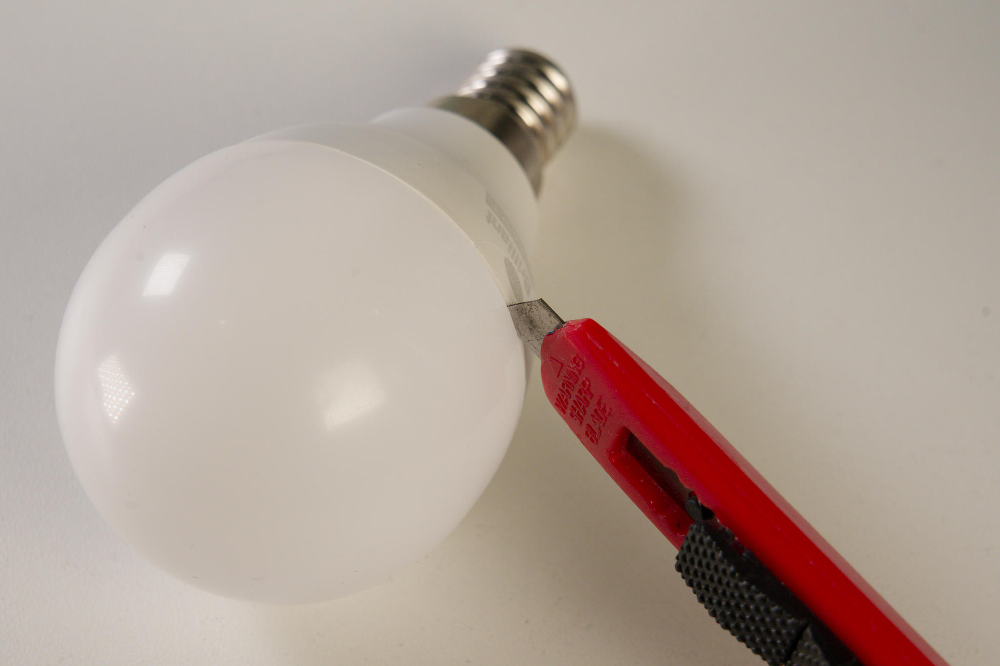
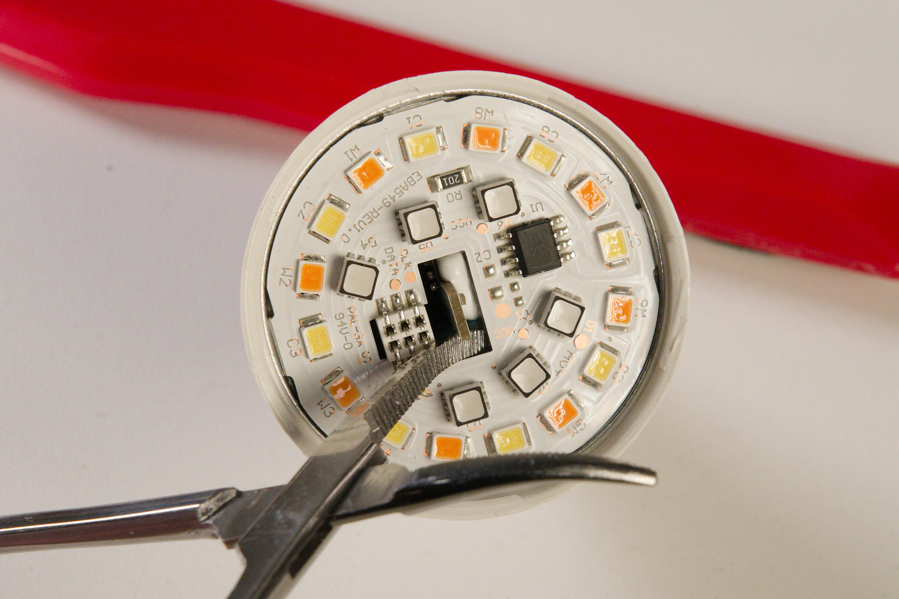
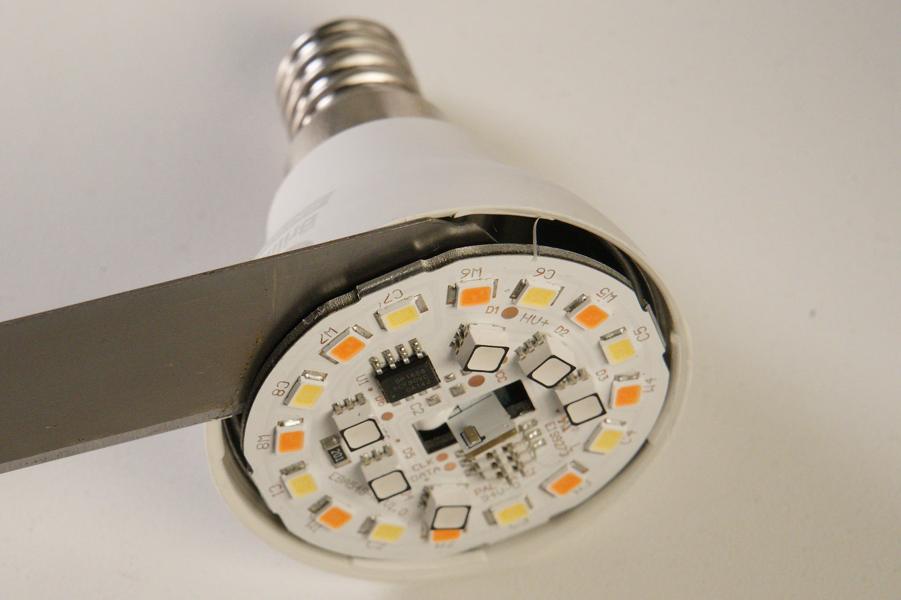
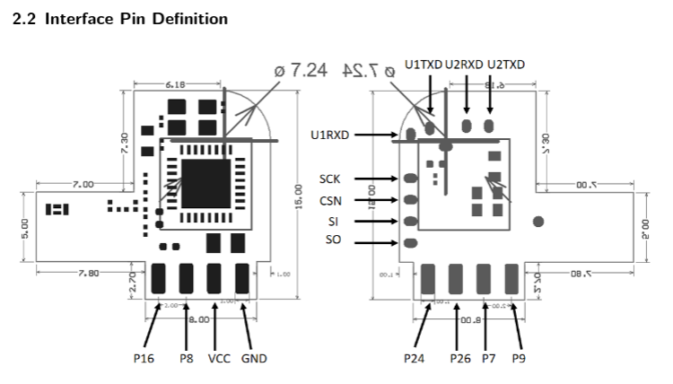
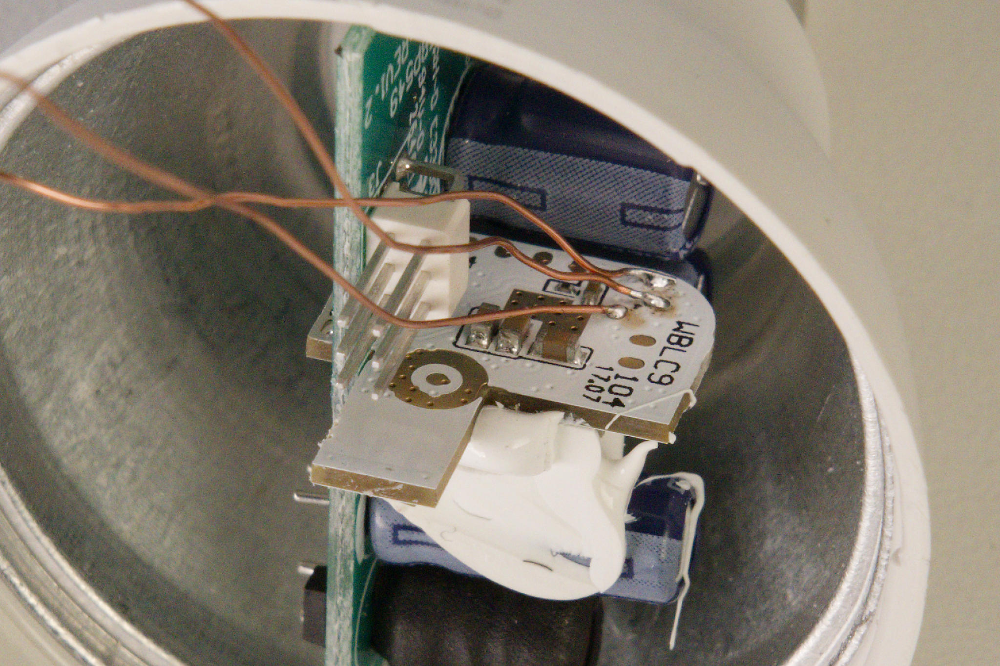
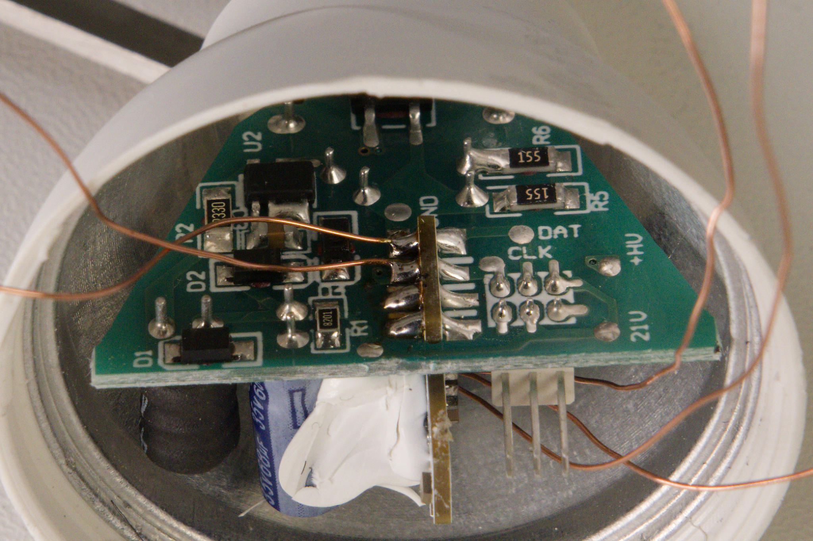
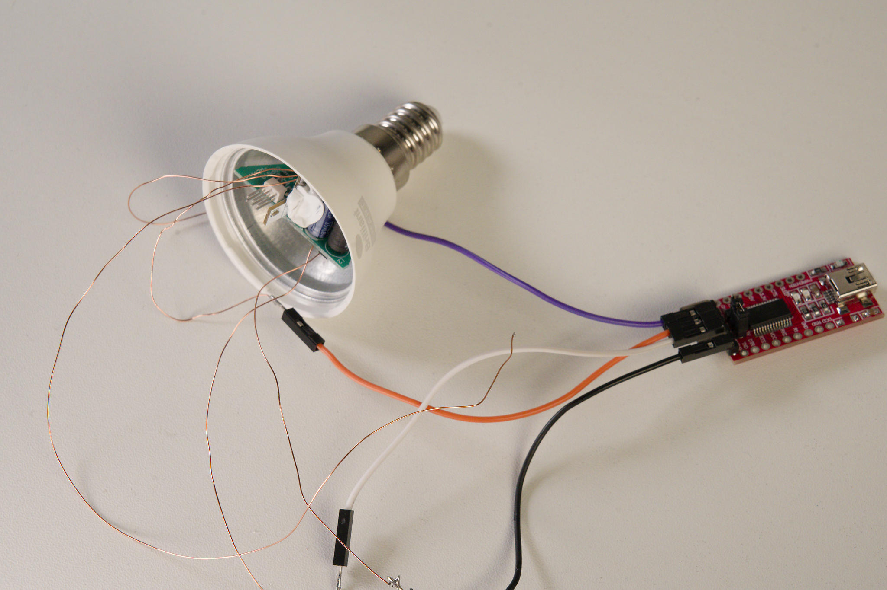
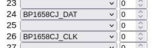
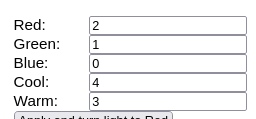

# Brilliant 21893 OpenBK Flashing Guide

Brilliant Lighting Model 21893, E14 (Australia / New Zealand). CCT+RGB 2700K-6500K, 4.3W 220V-240V 50Hz 36mA.

Product links: [Manufacturer](https://brilliantlighting.com.au/en-nz/products/brilliant-smart-rgb-cct-g45-e14-globe?_pos=1&_psq=21893&_psid=c4b776589&_ss=e), [PBTech](https://www.pbtech.co.nz/product/BULBRS21893/Brilliant-Smart-WiFi-LED-RGB-Smart-Light-Bulb-E14), [Paradigm](https://pp.co.nz/product/uu666269/), [Ascent](https://www.ascent.co.nz/productspecification.aspx?itemID=683367), [Dick Smith](https://www.dicksmith.co.nz/dn/buy/brilliant-smart-rgb-cct-g45e14-light-bulb-21893-09312641218937/).

Uses a Beken BK7231T chip. [Community info](https://www.elektroda.com/news/news3951016.html).

## Required Tools
* Small flathead screwdriver or similar tool for prying open the case.
* Isopropyl alcohol for loosening glue.
* Knife for cutting glue.
* Fine-tip soldering iron and solder.
* USB-to-serial adapter with 3.3V logic level support.
* Windows PC.

## Step 1: Opening

Insert a knife or similar tool into the seam of the case. Spraying isopropyl alcohol into the seam can help loosen the glue. Carefully work your way around the case until it pops open.

## Step 2: Removing the top PCB

Use a small screwdriver or similar to pry the top PCB out of the case. Be careful not to pry it out completely or you might pull the power wires away from the connectors at the back.

Slip a knife under the PCB and cut the glue holding it in place.

Once the glue is cut, you can lift the PCB out of the case. Pushing down on the WBLC9 module while lifting will help prevent the wires from being pulled out.

## Step 3: Soldering
WBLC9 Module Datasheet

Using a fine-tip soldering iron, solder wires to the following pins on the WBLC9 module.

Tips:
* Use thin wires to avoid stressing the pins.
* Tin the wires and the pins before soldering to make it easier.
* I use reverse tweezers to hold the bulb in place while soldering.

### RX, TX, CEN

From top to bottom, the pins are:
* U1_RXD (UART1_RX, User serial port RX)
* U1_TXD (UART1_TX, User serial port TX)
* CEN (Reset pin, connect to GND to reset the module)

### GND, VCC

From top to bottom, the pins are:
* GND (Ground)
* VCC (3.3V power supply)

## Step 4: Serial connection

Connect U1_TXD to the RX pin of your USB-to-serial adapter, U1_RXD to TX, GND to GND, and VCC to VCC. Make sure your USB-to-serial adapter is set to 3.3V logic level.

Leave the CEN pin unconnected.

## Step 5: Programming
The WBLC9 module uses a BK7231T chip. This isn't supported by ESP firmware like Tasmota, ESPHome, or WLED, but [OpenBK](https://github.com/openshwprojects/OpenBK7231T_App) firmware is available for it. You can use the [BK7231GUIFlashTool](https://github.com/openshwprojects/BK7231GUIFlashTool) to download OpenBK and flash the module.

Select the chip type BK7231T, then click ''Download latest from web'' to download the latest OpenBK firmware.

Click the ''Backup and flash new'' buttton, then touch the CEN wire to GND to reset the module. The tool should detect the module and flash it with OpenBK firmware.

## Step 6: Reassembly
Once the module is flashed, you can disconnect the USB and desolder the wires.

Line up the connector on the top PCB with the pins in the bulb and press it down until it fits into place. Then, snap the top cover back on.

## Step 7: Configuration
Once the light bulb is reassembled and powered on, it should broadcast a WiFi network. The name of the network will be something like `OpenBK-XXXX`. Connect to it and point your browser to `http://192.168.4.1/` to access the OpenBK web interface. From there, you can configure the light bulb to connect to your home WiFi network.

From the OpenBK web interface, click the ''Launch Web Application'' button.

From the Config page, set the pin settings:
* Pin 24: PB1658CJ_DAT
* Pin 26: PB1658CJ_CLK

From the Tools page, change the order of LED channels to match the bulb's wiring:
* Red: 2
* Green: 1
* Blue: 0
* Cool: 4
* Warm: 3

## Step 8: Control
The bulb can be controlled via the OpenBK web interface, or you can integrate it with home automation platforms like Home Assistant using MQTT.

### Home Assistant
Set up an MQTT broker in Home Assistant. If you're using Home Assistant OS, you can install the [Mosquitto broker add-on](https://github.com/home-assistant/addons/tree/master/mosquitto)(Home Assistant Settings -> Apps -> Install app).

By default Mosquitto in Home Assistant OS allows connections using the username and password of your Home Assistant instance. You can also create a dedicated user for the bulb in Home Assistant.

From the ''Configure MQTT'' page of the OpenBK web interface, enter the IP address of your Home Assistant instance, the MQTT port (usually 1883), and the username and password. Click Submit, then go to the Home Assistant Configuration page and click ''Start Home Assistant Discovery''. The bulb should now appear in Home Assistant as a light entity under the MQTT integration.
