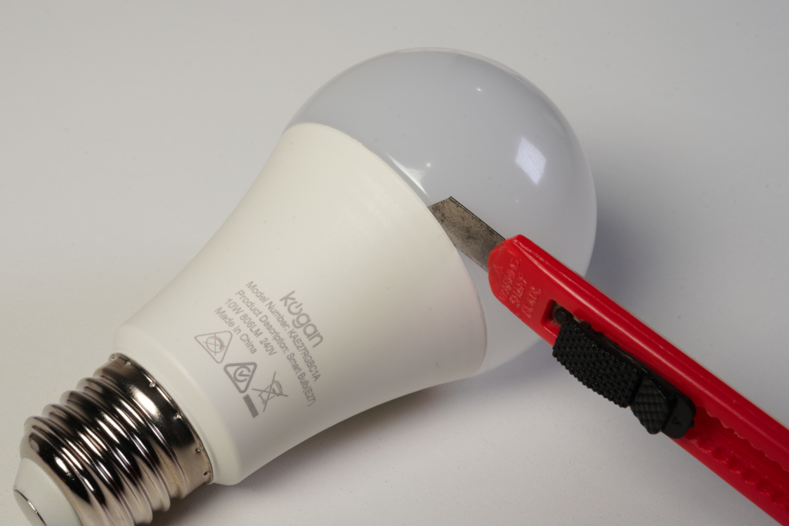
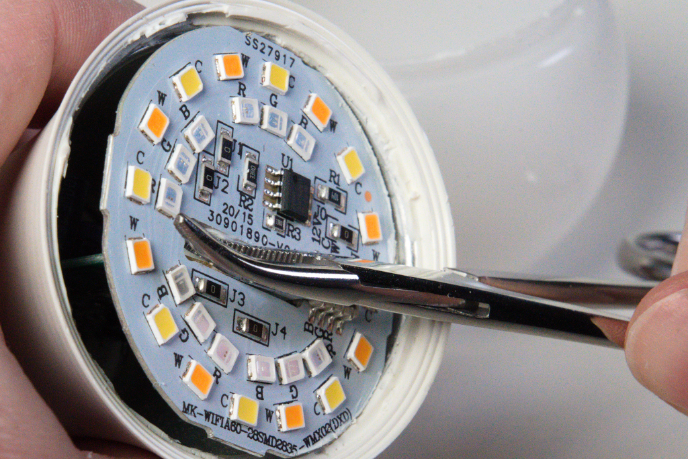
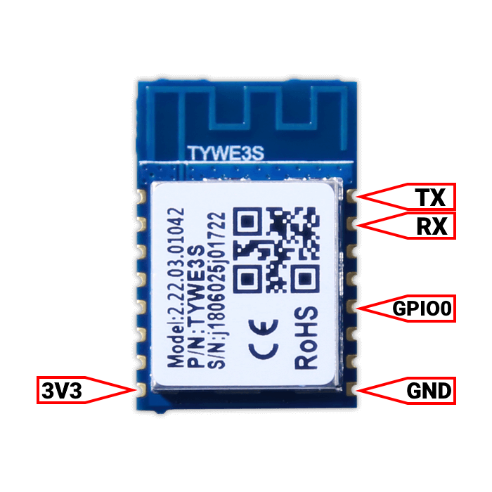
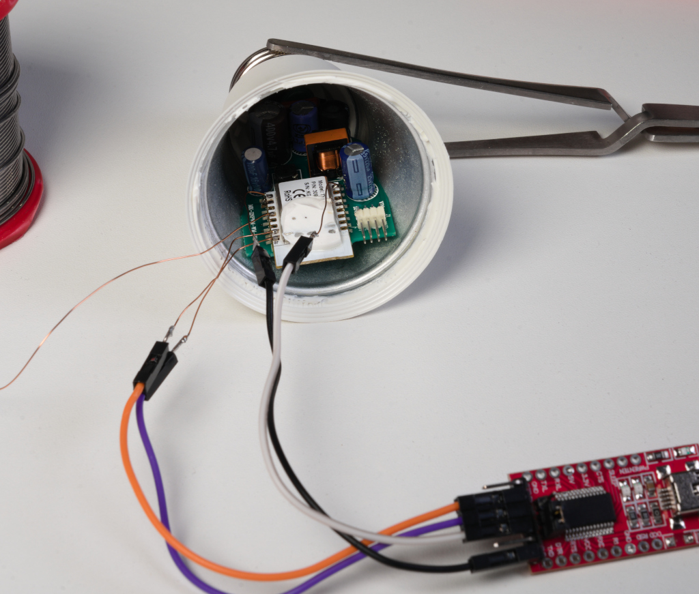
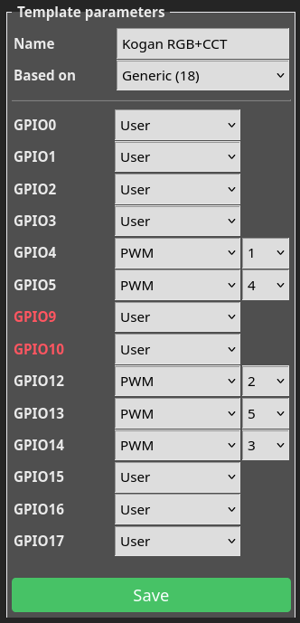
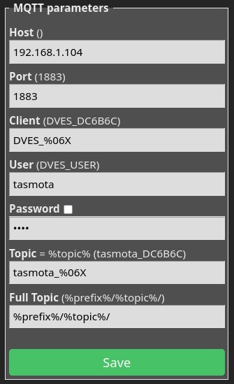
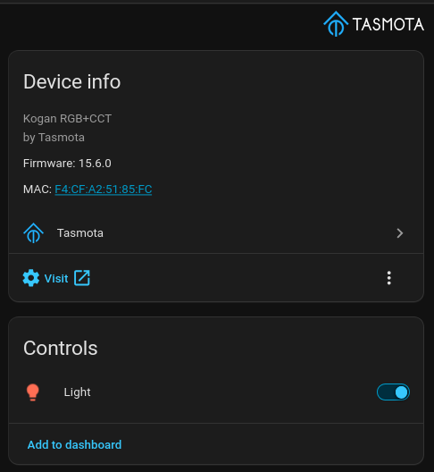

# Kogan KAE27RGBC1A Tasmota Flashing Guide

Kogan RGB+CCT Smart WiFi Light Bulb. Model KAE27RGBC1A. E27, 240V, 10W.

Product links: [Manufacturer](https://help.kogan.com/s/article/KoganSmarterHome10WColourWarmCoolWhiteSmartBulbE27WiFiKAE27RGBC1AKAE27RGBC2AKAE27RGBC4AManualsandSupport)

Uses a Tuya TYWE3L chip. Similar to TYWE3S, with an identical pinout: [Tasmota info](https://tasmota.github.io/docs/devices/TYWE3S/).

## Required Tools
* Small flathead screwdriver or similar tool for prying open the case
* Isopropyl alcohol for loosening glue
* Knife for cutting glue
* Fine-tip soldering iron and solder
* USB-to-serial adapter with 3.3V logic level support
* PC

## Step 1: Opening

The case is held together with glue. Insert a knife or similar tool into the seam of the case. Spraying isopropyl alcohol into the seam can help loosen the glue. Carefully work your way around the case until it pops open.

## Step 2: Removing the top PCB

Run a knife around the edge of the top PCB to cut the silicon holding it in place.

Use a small screwdriver or similar to pry the top PCB out of the case. Be careful not to pry it out completely or you might pull the power wires away from the connectors at the back.

Slip a knife under the PCB and cut the glue between the top PCB and the module.

Once the glue is cut, you can lift the PCB out of the case. Pushing down on the module while lifting will help prevent the wires from being pulled out.

## Step 3: Soldering
[TYWE3L Module Datasheet](https://images.tuyacn.com/goat/pdf/1718289789847/TYWE3S%20Module%20Datasheet_Tuya%20Developer%20Platform_Tuya%20Developer%20Platform.pdf). The pinout is identical to the TYWE3S module, so you can use the diagram below (which I took from the Tasmota documentation.)

Using a fine-tip soldering iron, solder wires to the pins on the TYWE3L module.

## Step 4: Serial connection
Connect the wires to your USB-to-serial adapter as follows. Make sure the adapter is set to 3.3V logic level.
* (TYWE3L → USB-to-serial)
* TX → RX
* RX → TX
* GND → GND
* 3V3 → VCC
* GPIO0 → GND (only during boot to enter programming mode)

## Step 5: Programming
The module uses an ESP8266 chip, so you can use Tasmota firmware. There are many ways to flash Tasmota, but the easiest is to use the [web-based installer](https://tasmota.github.io/install/).

Filter by type "Release" and select "Tasmota Lite". The most reliable speed is the slowest one (115200 baud).

Connect GPIO0 to GND during boot to put the module into programming mode.

## Step 6: Reassembly
Once the module is flashed, you can disconnect the USB and desolder the wires.

Line up the connector on the top PCB with the pins in the bulb and press it down until it fits into place. Then, snap the top cover back on.

## Step 7: Configuration
Once the plug is reassembled and powered on, it should broadcast a WiFi network. The name of the network will be something like `tasmota-1234AB-1234`. Connect to it and point your browser to `http://192.168.4.1/` to access the tasmota web interface. From there, you can configure the plug to connect to your home WiFi network.

From the Tasmota web interface, click the ''Template'' button and configure it as follows:
* Name: Kogan RGB+CCT
* Based on: Generic (18)
* GPIO4: PWM 1
* GPIO5: PWM 4
* GPIO12: PWM 2
* GPIO13: PWM 5
* GPIO14: PWM 3

After Tasmota restarts, go back to the configuration menu and select ''Module'' and select ''Kogan RGB+CCT'' from the list. This will configure the module to use the correct PWM channels for controlling the light bulb.

### Home Assistant
Set up an MQTT broker in Home Assistant. If you're using Home Assistant OS, you can install the [Mosquitto broker add-on](https://github.com/home-assistant/addons/tree/master/mosquitto)(Home Assistant Settings -> Apps -> Install app). Also install the [Tasmota integration](https://www.home-assistant.io/integrations/tasmota/).

By default Mosquitto in Home Assistant OS allows connections using the username and password of your Home Assistant instance. You can also create a dedicated user for the bulb in Home Assistant.

From the ''Configure MQTT'' page of the Tasmota web interface, enter the IP address of your Home Assistant instance, the MQTT port (usually 1883), and the username and password. Click Save, then after Tasmota restarts, the bulb should appear in Home Assistant as a light entity under the Tasmota integration.

